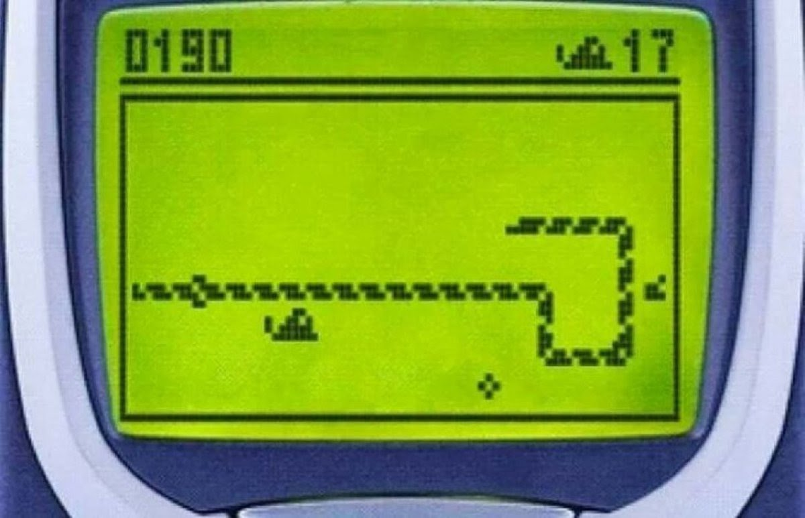
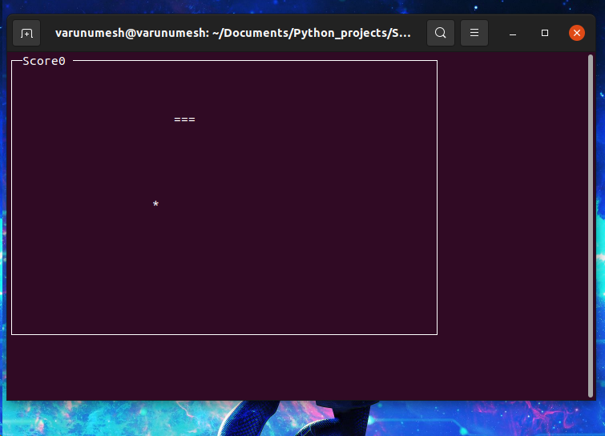

The script snake_game.py is a simple implementation of the classic snake game from the 90's.

The script uses pythons Curses library to execute and visulaize the game in Terminal.

To excute and play the game:
Clone the repo: 
>git clone http://github.com/VarunUmesh1407/Python_projects.git

In the folder Snake_game of the repository execute:
python 2:
>python snake_game.py

python 3:
>python3 snake_game.py

