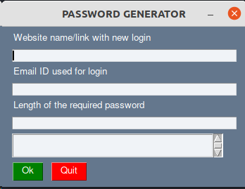
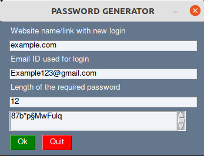

This implementaion is a random password generator with a simple GUI.

Execution:
> python3 -m gui_password

The GUI has three inputs:
1. The website for which the password necessary.
2. Email address / username for the login
3. Length of the password

When 'OK' button is clicked. A random password is generated. 
Check if it meets all necessary conditions.

The entered fields are saved in a csv file for future access.
